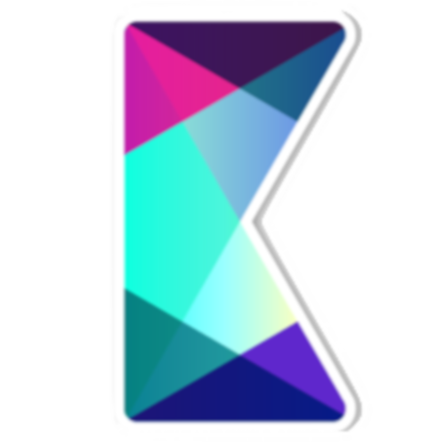
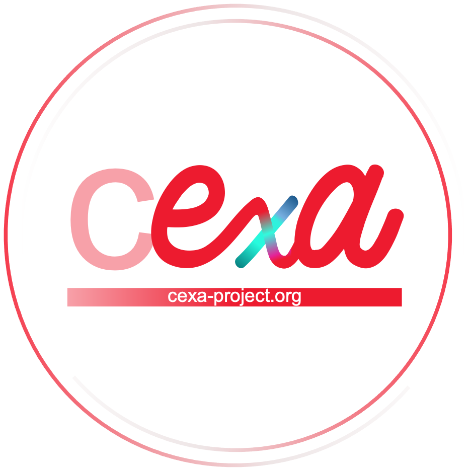

# CExA Kokkos Tutorials

This repository contains tutorials, exercises, and projects to learn Kokkos.
This course is intended for beginners and intermediate users who are not expert in C++ and GPU programming.
This course is part of the [CExA project](https://cexa-project.github.io/).

    
    

## Content

### Courses

- [Course 1: Introduction to Kokkos](courses/01_beginners/README.md)

> [!NOTE]
> You can get the slides from the [releases](https://github.com/CExA-project/cexa-kokkos-tutorials/releases) page.

### Exercises

- [Exercise 1: First Kokkos Program](exercises/02_first_program/README.md)
- [Exercise 2: Learn how to use and manage basic Kokkos View](exercises/03_basic_view/README.md)
- [Exercise 3: Mirror view and deep copy](exercises/04_deep_copy/README.md)
- [Exercise 4: Parallel Loop](exercises/05_parallel_loop/README.md)
- [Exercise 5: Parallel Reduce](exercises/06_parallel_reduce/README.md)

### Projects

- [Project 1: Wave Propagation](projects/wave/README.md)
