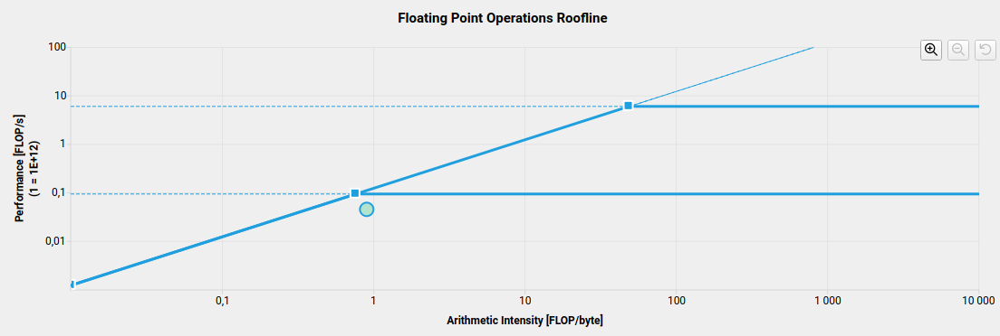

# Exercise 10: Profiling a Kokkos program

## Objective

The goal of this exercise is to profile an existing Kokkos program which solves the heat equation.

## Step 0: install Kokkos tools

This step is optional if you already have Kokkos tools installed.
In order to install the tools, you need to have Kokkos installed as well.
Please check [how to build Kokkos](../00_compiling_kokkos/README.md).

Clone the Kokkos tools repository:

```sh
git clone https://github.com/kokkos/kokkos-tools.git
```

Build and install it, do not forget to provide the Kokkos root path:

```sh
cmake -B build \
          -DCMAKE_BUILD_TYPE=Release \
          -DCMAKE_INSTALL_PREFIX=/path/to/kokkos-tools \
          -DKokkos_ROOT=/path/to/kokkos
cmake --build build --parallel 10
cmake --install build
```

Export some environment variables to make it easily useable:

```
export LD_LIBRARY_PATH=$LD_LIBRARY_PATH:/path/to/kokkos-tools/lib
export PATH=$PATH:/path/to/kokkos-tools/bin
```

## Step 1: add regions

A region is a block of code which performs several operations which can be considered as sub-steps for a larger grain step.
To set a region:

```
Kokkos::Profiling::pushRegion("name of the region");

// block of code

Kokkos::Profiling::popRegion();
```

The code has currently no regions.
Try to identify the big steps of the code in the function `compute`, and put them in regions.

## Step 2: add labels in parallel constructs and fences

Parallel constructs and fences take an optional character literals as first argument, which helps for debugging.
The code has no such character literals.
Try to identify the role of each parallel construct and fence in the function `compute` (the comments may help).

## Step 3: run with the Kokkos tools simple kernel timer

You have to install Kokkos tools first.

Set the environment variable to use the simple kernel timer:

```sh
export KOKKOS_TOOLS_LIBS=/path/to/kokkos-tools/lib/libkp_kernel_timer.so
```

Run your program after building it (on either backend):

```sh
./exe10
```

A `.dat` file containing the timings should have been generated in the same working directory.
Open it with `kp_reader`:

```sh
kp_reader name_of_file.dat
```

You should identify the intensive regions of the code and the intensive kernels.
If you had to optimize this solver, you should start by these hot spots first.

**Note:** you can compare the output of the profiler without the regions nor the labels.

## Step 4: run with the Kokkos tools kernel logger

You have to install Kokkos tools first.

Set the environment variable to use the simple kernel logger:

```sh
export KOKKOS_TOOLS_LIBS=/path/to/kokkos-tools/lib/libkp_kernel_logger.so
```

Run your program for only one iteration:

```sh
./exe10 100 1e-8 1
```

You should be able to trace the execution of the different kernels.
This could help you to identify a bug in the code.

**Note:** you can compare the output of the profiler without the regions nor the labels.

## Step 5: run with the NVTX connector

If you have an NVIDIA GPU, you can use the NVIDIA profiling tools.
You have to install Kokkos tools first.

Set the environment variable to use the NVTX connector:

```sh
export KOKKOS_TOOLS_LIBS=/path/to/kokkos-tools/lib/libkp_nvtx_connector.so
```

### Nsight Systems

Run your program for 10 iterations through Nsight Systems:

```sh
nsys profile -o report ./exe10
```

This should generate a `.nsys-rep` report file that you can open with the graphical interface of Nsight Systems:

```sh
nsys-ui report.nsys-rep
```

You should identify the calls to the Cuda API, along with the NVTX regions, which correspond to the regions and labels you introduced in the code.

### Nsight Compute

Run your program for 1 iteration through Nsight Comptu:

```sh
ncu \
        -o report -f \
        ./exe10solution 100 1e-8 1
```

This should generate a `.ncu-rep` report file that you can open with the graphical interface of Nsight Compute:

```sh
ncu-ui report.ncu-rep
```

This will give you the profiling of all kernels of the program, including kernels that did not explicitly appear in the code.
As it may be too cumbersome to identify the desired kernel, it is better to call Nsight Compute to profile only the desired kernel by using NVTX filtering:

```sh
ncu \
        -o report -f \
        --nvtx --nvtx-include "<name of the NVTX region>/" \
        ./exe10solution 100 1e-8 1
```

with `<name of the NVTX region>/` replaced by the name of the region of interest.
Note the final `/`.
Also note that the NVTX region may be a Kokkos region, or the label of a parallel construct, which implies you may have more than one kernel profiled.

Nsight Compute does not automatically record all the possible metrics, you can specify them one by one, or specify sets instead.
Re-run the profiler with the set "detailed":

```sh
ncu \
        -o report -f \
        --nvtx --nvtx-include "<name of the NVTX region>/" \
        --set detailed \
        ./exe10solution 100 1e-8 1
```

In the graphical interface, open the new report, navigate to the "GPU Speed Of Light Throughput" section, then select "GPU Throughput Rooflines" in the drop-down menu on the right (or scroll at the bottom of the section for old versions of Nsight Compute) to display the roofline graph for a specific compute intensive kernel.
Here is the roofline for the first kernel in the iteration loop, executed on a A500 NVIDIA GPU:



Depending on the available GPU, you may see what limits the performance of the kernel.
