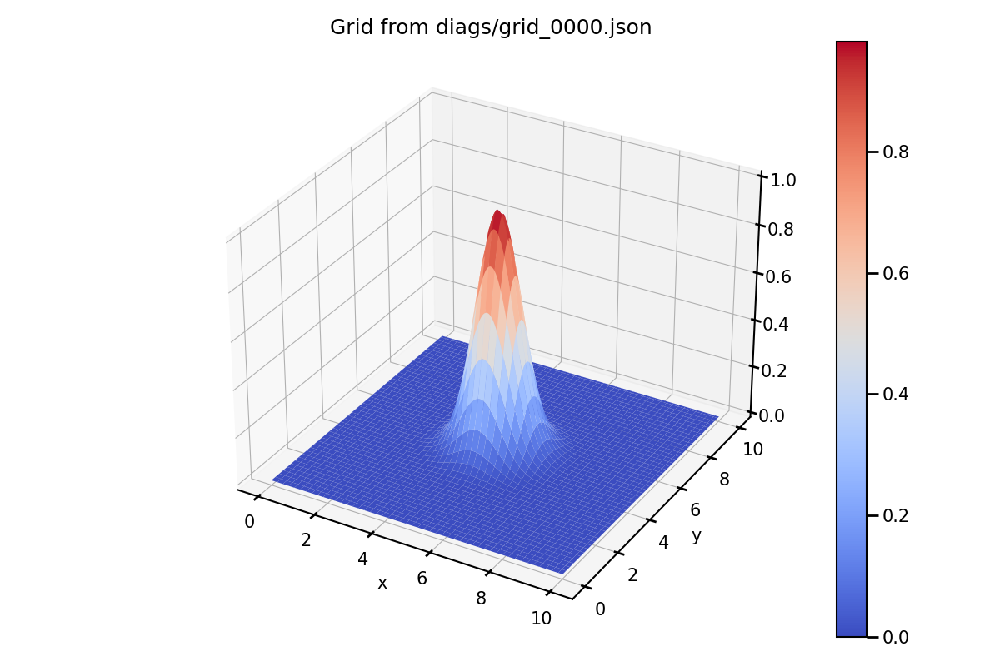
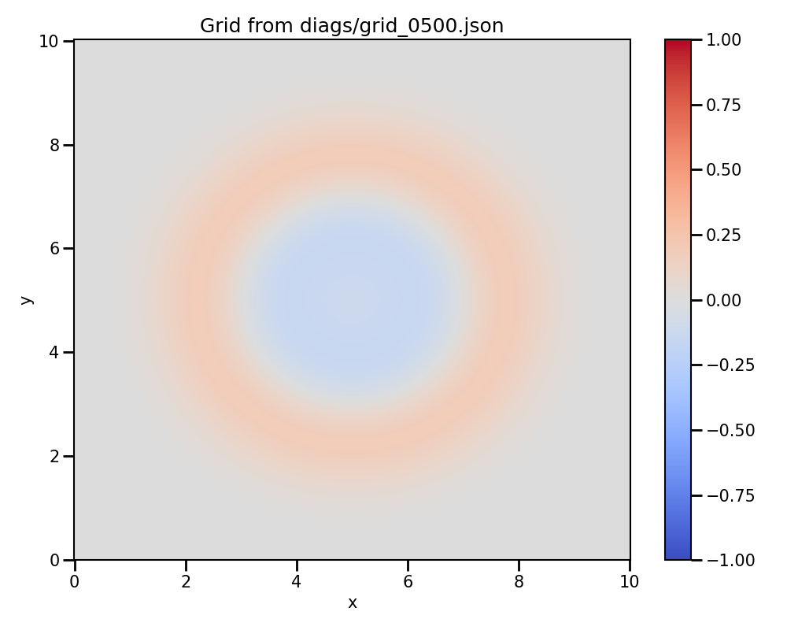
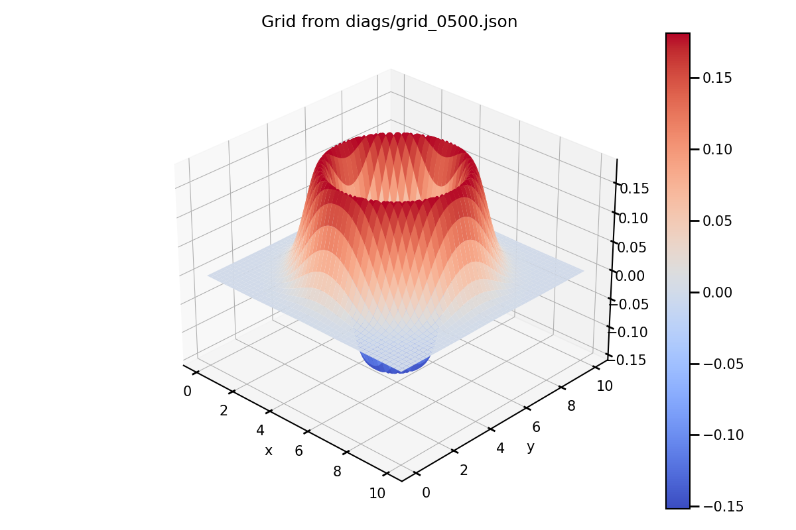

# Training project: 2d wave propagation code in Kokkos

The goal of this project is to implement a portable 2d wave propagation code using Kokkos.
We will start from a simple reference code.
The code is an implementation of the 2d wave propagation equation using a centered finite difference scheme as perfectly explained on this page https://hplgit.github.io/fdm-book/doc/pub/book/sphinx/._book008.html.

## Description of the code

The reference code is implemented both in sequential and using OpenMP.

### Build

```bash
cmake -DCMAKE_BUILD_TYPE=release -DCMAKE_CXX_COMPILER=<your compiler choice> ./
make
```

Compilation generates an executable `exe`.

### Run

The code can take command line arguments to tune the simulation without recompiling the code.
The following options are available:

- `--size <Nx> <Ny>`: number of points in the x and y directions
- `--domain-length <Lx> <Ly>`: domain length in the x and y directions
- `--time <simulation_time>`: simulation time
- `--cfl <CFL_factor>`: factor applied to compute the time step from the CFL condition
- `--sound-speed <c>`: sound speed
- `--print-period <print_period>`: print period in the terminal
- `--output-period <output_period>`: output period of the diagnostic files
- `--boundary <boundary_conditions>`: boundary conditions (0: Dirichlet, 1: Neumann)

For instance:

```bash
./exe --size 100 100 --domain-length 1.0 1.0 --time 1.0 --cfl 0.5 --sound-speed 1.0 --print-period 10 --output-period 10 --boundary 0
```

### Initiale conditions

The code initializes the grid with a Gaussian in the center of the domain.

|  |
|:--:|
| Example of an initial condition |

### Diags and visualization

The code creates a directory called `diags`at the beginning of the simulation.
The grids are saved in this directory at the requested output period (`--output-period`).
Grid diagnostics are json files so that they can easily read with Python or even with a text editor. 
They have the following structure:
```json
{
    "parameters" : {
        "Nx" : Nx,
        "Ny" : Ny,
        "dx" : dx,
        "dy" : dy,
        "it" : it
    },
    "data" : U
}
```

Python scripts are provided to plot the grid diagnostics.
They are located in the `python` directory of this project.
You have several scripts:

- `plot.py <diags_file>`: plot the grid from the provided diagnostic file using a 2d colormap
- `plot_3d.py <diags_file>`: plot the grid from the provided diagnostic file using a 3d surface plot
- `animate.py <diags_dir>`: plot an animation of all the files contained in the provided directory
- `animate_3d.py <diags_dir>`: plot an animation of all the files contained in the provided directory using a 3d surface plot

|  |
|:--:|
| Example of a snapshop generated by the script `plot.py`|

|  |
|:--:|
| Example of a snapshop generated by the script `plot_3d.py`|

### Structure of the code

The code is contained in a single file `main.cpp`.

The code is structured as follows:

1) Simulation parameters declaration
2) Command line arguments parsing
3) Processing of the simulation parameters
4) Terminal summary
5) Large grid memory allocation and initialization
6) Time loop
7) Timer output

The time loop has the following structure:

- a) Computation of the wave propagation, we compute `U_next` from `U` and `U_prev`
- b) Boundary conditions
- c) Update of the grid for the next iteration, we copy `U_next` into `U` and `U_prev` into `U_next`
- d) Sum of the grid
- e) Output of the grid (if requested)
- f) Print of the simulation progress (if requested)

## Kokkos version

We propose a stet-by-step guide to convert the reference code to use Kokkos. You are free to implement the code in any way you want, but we recommend following the steps below. Between each step, you should be able to compile and run the code on CPU to check that everything is working as expected.

**Goal**: For the Kokkos version, we would like to use the `Kokkos::view` to manage the memory on the Host and the Device. We will also use the `Kokkos::parallel_for` to parallelize the loops. The initialization phase must be done on the Host, and the computation phase must be done on the Device.

**Step 0**: Open the reference code (`main.cpp`) file to understand how the program works. Compile and execute the reference code. Use the python scripts to plot the diagnostic files. 

**Step 1**: Create a new directory `kokkos` and copy the `main.cpp` file and the `CMakeLists.txt` from the reference version. Add the Kokkos initialization at the beginning of the `main` function and update the `CMakeLists.txt` to link with Kokkos. Convert now the timer computation to use `Kokkos::Timer` instead of `std::chrono`.

**Step 2**: Start by changing the code to use 2D `Kokkos::view` instead of `std::vector`. You will need a view for the device side and a mirror for the host one. You can keep the names `U`, `U_prev` and `U_next` for the memory allocated on the Device and `U_host`, `U_prev_host` and `U_next_host` for the memory allocated on the Host. Update the C++ loops to use the `Kokkos::view` without using the `Kokkos::parallel_for` yet. Do not forget to update as well the function `write_grid` to be able to write the results on disk.

**Step 3**: We will now focus on the initialization. Use `Kokkos::parallel_for` to initialize the grid explicitely on the Host. You can use the `Kokkos::MDRangePolicy` to define the range of the loop and the use of the `DefaultHostExecutionSpace`.

**Step 4**: Now, we will focus on the time loop. Use `Kokkos::parallel_for` to compute the wave propagation on the device. You can use the `Kokkos::MDRangePolicy` to define the range of the loop. The time loop is performed on the `DefaultExecutionSpace` (i.e. on GPU if Kokkos compiled with a GPU backend, else on CPU. You will need to use the `Kokkos::deep_copy` to copy the data from the Host to the Device and vice-versa.

**Step 5**: Update the computation of the sum of the grid using `Kokkos::parallel_reduce` following the same approach as for the `Kokkos::parallel_for`.

**Step 6**: Compile and run the code using the Kokkos OpenMP backend. Compare the results with sequential or the OpenMP version. Use the python scripts to plot the diagnostic files.

**Step 7**: if you can access a GPU, compile and run the code using the corresponding Kokkos GPU backend. Compare the results with the OpenMP version. Use the python scripts to plot the diagnostic files. 

## Performance analysis

**Step 1**: Select different problem size so that the total grid size will vary from hundreds of kB to several Gb.

For instance:

- `--size 256 256`:  192 kB
- `--size 1024 1024`: 3 MB
- `--size 32768 32768`: 3 Gb

Compare the performance on CPU and GPU.

